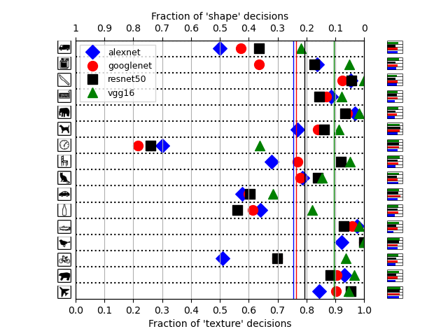

# Reproduction of the results from the "ImageNet-trained CNNs are biased towards texture; increasing shape bias improves accuracy and robustness" paper
Authored by Gianluca de Bruin & Sebastiaan Hermans, both from the MSc Applied Physics at Delft University of Technology.
Made for the Deep Learning course CS4240 2021, an elective within the MSc Computer Science.

In this repository the code and stimuli can be found that were used to reproduce figure 4 from the paper "ImageNet-trained CNNs are biased towards texture; increasing shape bias improves accuracy and robustness" by R. Geirhos et al. The stimuli and the classification code is used from the repository belonging to this paper: https://github.com/rgeirhos/texture-vs-shape. 

Here our blogpost on this subject can be found: https://sahhermans.github.io/DL-2021-GR-33/.

In this repository multiple folders and files can be found:

`main.py`
Main script. Imports models, evaluates input data, generates figures and saves output. 

`results`
Folder containing final data collected in four successful runs of the script. 

`code`
Code used from the repository of the original paper that is responsible for the selection of the classification category.

`data-analysis/category-images`
Set of images of the sixteen categories copied form the repository of the original paper, used to recreate figure 4 from the paper. 

`stimuli/style-transfer-preprocessed-512`
The used set of stimuli can be found in the stimuli folder. Each subfolder contains 80 style-transferred images of an image from the category indicated by the subfolder name.

`docs`
Modified template from https://github.com/pages-themes/cayman.

Below the result of the reproduction of figure 4 from the original paper.
 
