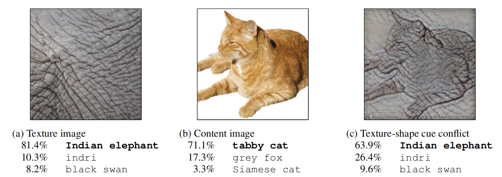
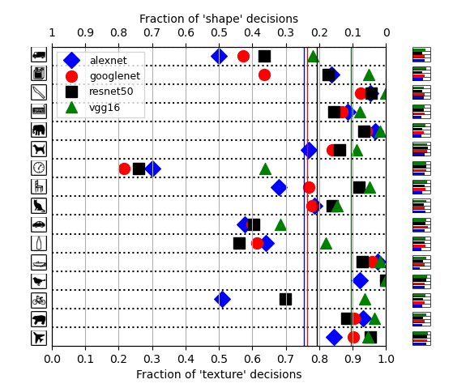
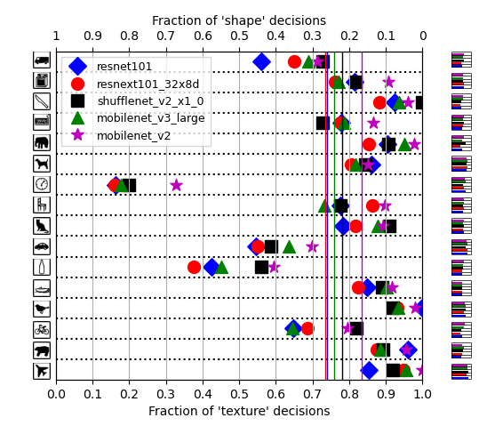
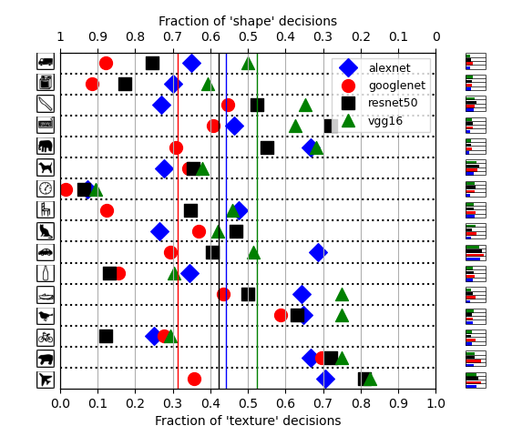
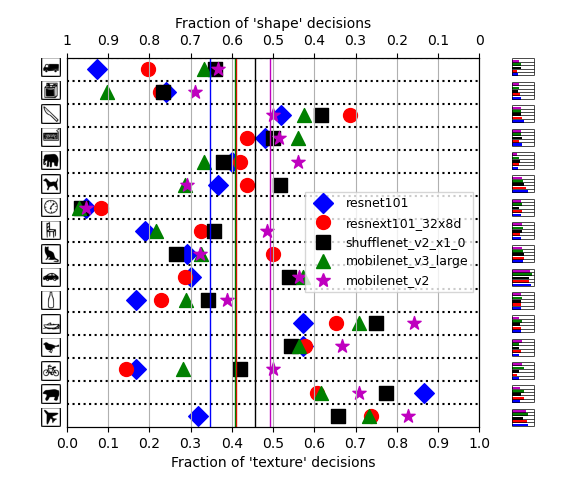

In this blogpost, the shape and texture bias of ImageNet trained convolutional neural networks (CNNs) is studied. In 2018, the study done by Geirhos et al.[1] titled "_ImageNet-trained CNNs are biased towards texture; increasing shape bias improves accuracy and robustness_" showed that CNNs have a very strong texture bias. This is in contrast to human behaviour due to fundamental different classification strategies between humans and CNNs. 
Firstly, a short introduction into the paper is given. After this, the method is described, explaining how the results are reproduced. Hereafter, the results are given and discussed. The blogpost is finalised by giving a short conclusion.

## Introduction
Convolutional neural networks are a class of deep neural networks. They can be seen as limited parameters versions of a feed forward network and are known for their wide applications on computer vision tasks. 
CNNs are equivariant for convolution and translation, meaning that the order of translation and convolution does not matter. This shift invariance is especially useful for computer vision tasks as objects to be detected may appear at arbitrary locations in an image. 

There is some debate about the ability of CNNs classifying images. Some studies suggest a “shape hypothesis”, meaning that CNNs classify images heavily based on their shape rather than e.g. colour and texture, such as the study done by Ritter et al.[2] The shape is also found to be a very important feature for human image classification, according to Landau et al.[3]
Oppositely, some studies suggest a so-called “texture hypothesis”. This is found in e.g the study done by Gatys et al.[4], where the shape structure of the object is distorted and mainly texture cues are present, and it is found that most classification decisions are based on texture. 

In this blogpost and the original paper by Geirhos et al., style transferred images with a shape-texture cue conflict are studied to gain more insight in the decision cues of CNNs. The style transfer method is given in the study done by Gatys et al.[5] and an example is given in Figure 1. 

> Figure 1. Classification of a standard ResNet-50 of (a) a texture image (elephant skin: only texture cues); (b) a normal image of a cat (with both shape and texture cues), and (c) an image with a texture-shape cue conflict, generated by style transfer between the first two images. This image was copied from the original paper.[1]

## Method
### Reproduction
To reproduce the results from the original paper, the original style-transferred ImageNet dataset is used. The images are grouped by their shape cue and images with a cue conflict, i.e. images that have the same shape as texture, are excluded.
Using PyTorch different pretrained models are imported. For each model, the images without a cue conflict are fed into the network and the output is evaluated. There are three possible outputs: a shape decision is made, a texture decision is made, or neither the shape nor the texture is guessed correctly. 
The shape bias is then given by the ratio of the number of images that is classified by shape, divided by the number of images that is classified by either texture or shape. The texture bias is equal to one minus the shape bias.
The accuracy of the model is given by the number of shape decisions plus texture decision, divided by the total number of images fed into the model. In formula form, the shape bias reads:

$b_{shape} = \frac{n_{shape\ decision}}{n_{shape\ decision} + n_{texture\ decision}}$

A plot is made of the model decisions, showing the ratio of the texture and shape bias per shape category. Besides this, the accuracy of the models is shown per category.

### Gaussian filter
To study the effects of smoothening on the shape vs texture decision, a gaussian filter is implemented using the `skiimage` library. A multichannel filter is applied for the standard deviation of the Gaussian kernel size $\sigma = 2$. These images are fed to the models, similarly as described for the reproduced figure and similar data is obtained.

## Results & Discussion
In the figure 2 below the reproduction results can be found of the same models that were used in the original paper. 

> Figure 2. Results for the four models used in the original paper for the shape vs. texture bias experiment using stimuli with cue conflict. On the left side the shape categories are depicted. In the central figure the results of the shape vs. texture biases for stimuli with cue conflict are depicted for each individual model. The averages are visualised by vertical lines. On the right side, subplots display the proportion of correct decisions (so if the model recognised either the texture or the shape) as a fraction of all trials.

The reproduced results show qualitatively the same as the original results. All four models indicate having a texture bias, although the reproduced results show a stronger bias than found in the original paper. The VGG model shows the strongest texture bias, followed by resnet, googlenet and lastly, alexnet. This order was also found in the original paper. Categories that were biased towards either texture or shape decisions in the original paper, show the same behaviour in the reproduced results. For example, the clock, bicycle, bottle, car and truck categories show a relatively large shape bias compared to the other 
categories, whereas the elephant, bear, plane and knife show relatively large texture biases. 

Differences between the two sets of results can be found in the accuracy plots. The relatively high accuracies found for, for example, the bottle and truck categories in the original paper, were not reproduced. Similarly, in the reproduced results relatively high accuracies were found for the plane categories, which was not the case in the original paper. Both the original paper and the reproduced results used pre-trained versions of the models from torchvision. As the implementation of the original paper was followed exactly, the found difference seems to be a result of differing torchvision versions, with possibly different trained weights.

In figure 3 the results of multiple models that were not used in the original paper. The figure shows results qualitatively similar to the original four models. Although the smaller mobile nets (mobilenet & shufflenet) show a somewhat larger texture bias than the resnet and resnext nets, the mean texture bias of all models is comparable to those found in the original experiment. 

> Figure 3. Results for five models not used in the original paper for the shape vs. texture bias experiment using stimuli with cue conflict.

In figures 4 & 5 the results of the gaussian blur experiments can be found for both the four models used in the original experiment and the five new models. 
Due to the blurring of the images, the shape bias seems to have been increased. The mean decision ratio is shifted to the centre, having a small deviation to the shape bias.
The gaussian blur resulted in a higher part of the images being selected on shape, at great expense of the accuracy. More than half of the decisions are made incorrectly. This indicates that this is not a suitable method to increase the shape bias for image classification.
For further research, it is advisable to test different widths of the gaussian blur and study the effects. 

> Figure 4. Results for all tested models for the shape vs. texture bias experiment using stimuli with cue conflict, filtered with a gaussian blur with standard deviation of 2.

> Figure 5. Results for all tested models for the shape vs. texture bias experiment using stimuli with cue conflict, filtered with a gaussian blur with standard deviation of 2.

To make sure that the findings were not a result of the chosen image categories (which seems unlikely) or a result of the way that iterative style transfer was applied to the cue conflict images, a new image set could be created and tested. This would also further strengthen the conclusions from the original paper. That the original data was used to reproduce the results, is probably the biggest shortcoming of this reproduction. 

## Note of critique
We would like to end with a note of critique on the original paper, that is outside the scope of our own reproduction. Figure 10 in the appendix of the original paper shows the classification results for human observers on stimuli with a texture-shape cue conflict, where biased-decision rather than neutral-decision instructions were given to the human observers. Although it is unclear how exactly the experiment was performed, the figure shows that even in the case that a human observer was told to classify based on the texture of the image, the human observer still made the majority of classifications based on the shape present in the images. We believe that this result was more a consequence of the limited time that a human observer got to look at the image, than his inability to classify the image based on its texture. 

This initial response of a human observer was apparently deemed more fair to compare with CNNs than having the image be exposed to the human observer for longer times. This was probably done for the same reason the full-contrast pink noise mask was shown to the human observer after each image, to ‘minimise feedback processing in the human visual system and to thereby make the comparison to feedforward CNNs as fair as possible’. The authors never explain why exactly this would make for the better comparison with CNNs, and even though we can think of arguments for this reasoning, we can also think of just as many arguments against it. 

In any case, the results shown in figure 10 indicate that it matters whether you tell a human observer to focus on the shape or the texture of the image. If you do not tell a human what to focus on, the human observer might decide for himself what to focus on. If the human observer makes the choice to classify the first image in the experiment based on the shape present in the image, then the rest of the experiment will be biased due to this initial choice. Seeing that he classified the first image based on the shape, he will start classifying all other images based on their shape too, whether he made the conscious decision to do so or not. Even though it may be that humans have a shape bias in the way they classify images, the results obtained in this experiment might not give an unbiased impression of that bias. 

Although ultimately none of the human results matter for the results of the CNNs, we do not understand why the authors put so much effort into these human experiments in order to compare them to the CNN’s. That humans can classify images based on both textures and shapes, in itself might make their classifications inherently incomparable to those of CNNs. 

However, studying how humans classify images can help make computer vision algorithms better, as was shown in this paper too by training the CNNs to have more of a shape bias based on the assumption that humans classify images with a large shape bias. Studying what kind of images humans classify based on texture or shape, and why, might yield interesting information that could help further improve the workings of CNNs. Nonetheless, comparing CNNs to humans is more complex than the paper makes it out to be. 

## Conclusion
Using the original data, the results were qualitatively reproduced. Models not tested in the original paper also showed similar texture biases as the four models originally tested. The suspected texture bias was further investigated by filtering the input images with a gaussian blur. The shape bias increases for blurred images, at the expense of the accuracy of the models. The biggest shortcoming of this reproduction, is that the original data was used to reproduce the results. 

### References
[1] Geirhos, R., Rubisch, P., Michaelis, C., Bethge, M., Wichmann, F. A., & Brendel, W. (2018). ImageNet-trained CNNs are biased towards texture; increasing shape bias improves accuracy and robustness. arXiv preprint arXiv:1811.12231.

[2] Ritter, S., Barrett, D. G., Santoro, A., & Botvinick, M. M. (2017, July). Cognitive psychology for deep neural networks: A shape bias case study. In International conference on machine learning (pp. 2940-2949). PMLR.

[3] Landau, B., Smith, L. B., & Jones, S. S. (1988). The importance of shape in early lexical learning. Cognitive development, 3(3), 299-321.

[4] Gatys, L. A., Ecker, A. S., & Bethge, M. (2017). Texture and art with deep neural networks. Current opinion in neurobiology, 46, 178-186.

[5] Gatys, L. A., Ecker, A. S., & Bethge, M. (2016). Image style transfer using convolutional neural networks. In Proceedings of the IEEE conference on computer vision and pattern recognition (pp. 2414-2423).
